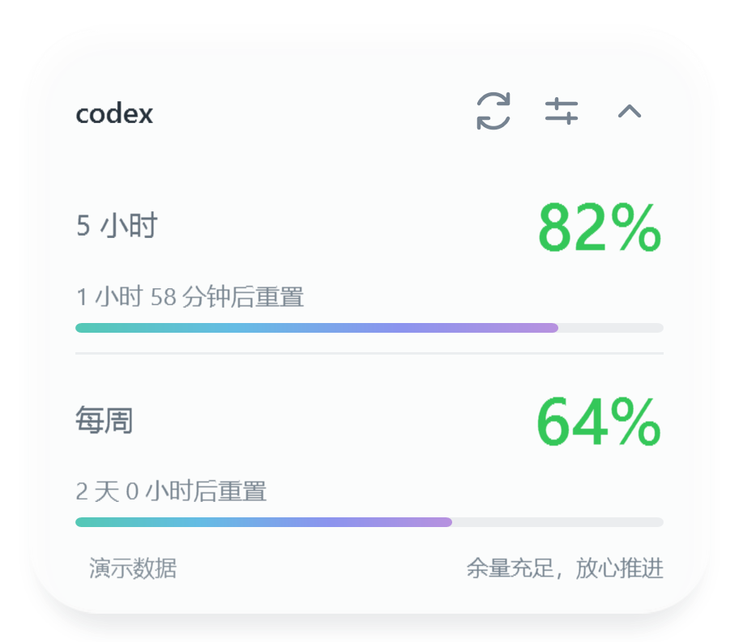

# Codex Quota Glass

**额度，一眼可见。**

轻巧的 Windows Codex 额度悬浮窗。白色半透明卡片与渐变进度条，随 Codex 前台状态自动显示与隐藏。

Windows 10/11 · .NET Framework 4.8 · 便携运行 · MIT



## 功能

- 额度周期、剩余百分比、重置倒计时，每 60 秒刷新。
- 展开与精简模式、固定品牌字号与按钮位置、拖动位置保存。
- 明亮白色半透明底色，可调透明度，圆角与柔和阴影。
- 百分比：大于 30% 绿色、10–30% 黄色、不超过 10% 红色。
- 托盘常驻、快捷键唤醒、重复启动唤醒，可选开机启动。

截图为演示数据。当前玻璃材质不包含背景模糊。

## 快速开始

需要 Windows 10/11、.NET Framework 4.8，以及已安装并通过 ChatGPT 登录的 Codex CLI。仅安装桌面应用而没有可找到的 CLI 时，需配置 CLI。

1. 解压 CodexQuotaGlass-portable.zip 到固定、可写的文件夹。首次发布前可从源码构建。
2. 双击 Start.cmd 或 CodexQuotaGlass.exe。
3. 回到 Codex 查看额度，托盘图标表示程序仍在运行。

无需管理员权限。请先解压整个 ZIP，保留 EXE 同目录的 .config 文件。偏好保存在同目录 settings.json。

### 从源码构建

使用 Windows .NET Framework 自带编译器，无需 npm 或第三方 NuGet 包。

```powershell
.\build.ps1 -Test -Package
.\outputs\CodexQuotaGlass\Start.cmd
```

便携包输出到 outputs/CodexQuotaGlass-portable.zip。GitHub Actions 构建、测试并上传相同 ZIP。

## 启动与唤醒

| 入口 | 行为 |
|---|---|
| 双击 Start.cmd / EXE | 启动；已运行时唤醒已有窗口 |
| Ctrl + Alt + Q | 程序运行时唤醒 |
| 双击托盘图标 | 唤醒 |
| 右键托盘 → 显示悬浮窗 | 唤醒 |
| 回到 Codex 前台 | 自动显示 |
| CodexQuotaGlass.exe --background | 后台启动，不临时显示 |

开启“仅 Codex 前台显示”时，**手动唤醒会临时显示 15 秒**，然后恢复前台跟随。需要始终显示，可关闭该选项。快捷键仅在程序运行时有效；若被占用，使用托盘或重复启动。

### 可选：登录 Windows 后启动

在便携包目录双击 Enable-Startup.cmd，只在当前用户启动文件夹创建快捷方式，下次登录后后台运行，无需管理员权限。

双击 Disable-Startup.cmd 移除快捷方式。默认不会开启。移动目录后需在新位置重新启用；删除程序前先禁用。脚本执行策略选项仅作用于本次 PowerShell 进程，不修改系统策略。

## 操作

| 操作 | 方式 |
|---|---|
| 移动 | 拖动卡片空白处 |
| 展开 / 收起 | 右侧箭头，或双击空白处 |
| 刷新 | 刷新图标或托盘菜单 |
| 透明度 | 设置图标，5–65%，默认 14% |
| 前台跟随 | 设置或托盘中的“仅 Codex 前台显示” |
| 退出 | 托盘菜单 → 退出 |

额度为账户共享，不是当前聊天独有。失败时保留旧数据并提示失败；重置后等待接口更新，不自行恢复成 100%。

## 常见问题

**没有窗口？** 查看托盘及折叠图标区。前台跟随可能隐藏窗口；回到 Codex、双击托盘或按 Ctrl + Alt + Q。快捷键不能启动已退出的程序。

**未找到 Codex / 查询失败？** 确认 CLI 已安装并通过 ChatGPT 登录，检查网络。查找顺序：CODEX_QUOTA_CLI、PATH 中 codex.exe、%LOCALAPPDATA%\OpenAI\Codex\bin。指定路径后重新启动：

```powershell
$env:CODEX_QUOTA_CLI = 'C:\path\to\codex.exe'
.\outputs\CodexQuotaGlass\CodexQuotaGlass.exe
```

**更新？** 托盘退出后替换文件，保留 settings.json，再启动。

**恢复默认？** 退出，删除同目录 settings.json，再启动。

**快捷键无效？** 确认程序运行。被占用时，唤醒后的托盘提示会说明；双击托盘仍可用。

## 数据与隐私

通过本地 codex app-server --stdio 的 account/rateLimits/read 查询。程序不读取或保存登录凭据、不发起模型任务，无遥测。登录与网络查询由 Codex CLI 处理。前台跟随只检查进程与安装路径，不读取窗口内容。

依赖 Codex 接口与进程识别，未来版本可能影响兼容性。混合 DPI、多显示器及其他安装方式欢迎反馈。当前构建产物未签名。

## 开发与贡献

```powershell
.\build.ps1 -Test
.\outputs\CodexQuotaGlass\CodexQuotaGlass.exe --ui-check
```

- src/App.cs：界面、托盘、前台识别、动效与唤醒。
- src/QuotaClient.cs：只读查询与解析。
- tests/QuotaTests.cs：数据、颜色、提示和倒计时检查。
- --preview / --preview --compact / --preview --settings：生成 3× 分辨率演示 PNG。
- --ui-check：检查布局、透明边缘、模板和切换状态，不能代替动效体验检查。

欢迎 [参与贡献](CONTRIBUTING.md)。问题请附 Windows 版本、缩放比例与复现步骤，不要上传 auth.json、令牌或账户日志。

## 许可证

[MIT](LICENSE)。独立社区项目，与 OpenAI 无隶属关系。
